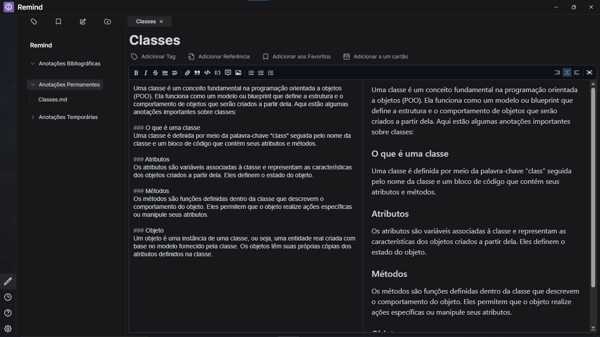

# Remind

Remind é um software de gestão de conhecimento que está sendo desenvolvido como trabalho de graduação do curso de Análise e Desenvolvimento de Sistemas.  
O sistema é baseado no método *Zettelkasten* e na técnica de repetição espaçada, com o objetivo de melhorar a retenção de conteúdo estudado no longo prazo.

## Tecnologias

